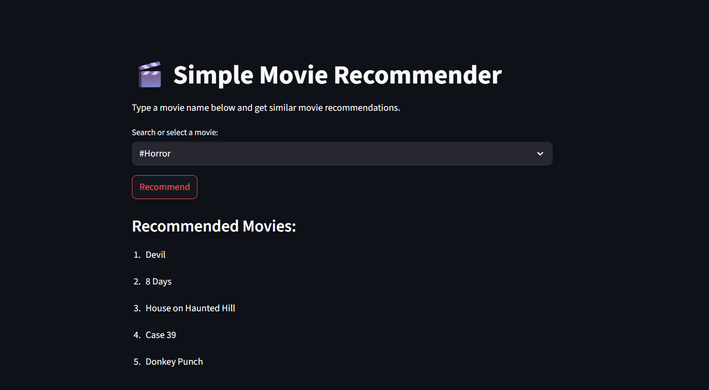

# 🎬 Simple Movie Recommender System

This is a **content-based movie recommendation system** built using **Python, NLP, and Streamlit**. It suggests movies similar to the one you type in, based on genre, keywords, cast, crew, and description.

---

## 📌 Features

- 🔍 Search for a movie by its title
- 🤖 Get top 5 similar movie recommendations
- 💡 Uses NLP techniques like stemming and vectorization
- 🧠 Cosine similarity-based matching
- 🌐 Interactive and simple web interface using Streamlit

---

## 🛠️ Tech Stack

- **Python**
- **Pandas** – data processing
- **NLTK** – stemming
- **Scikit-learn** – vectorization & similarity
- **Streamlit** – frontend web app

---

## 🚀 Getting Started


### 1. Clone the repo

```bash
git https://github.com/MrShalby/movie-recommender
cd movie-recommender

---


